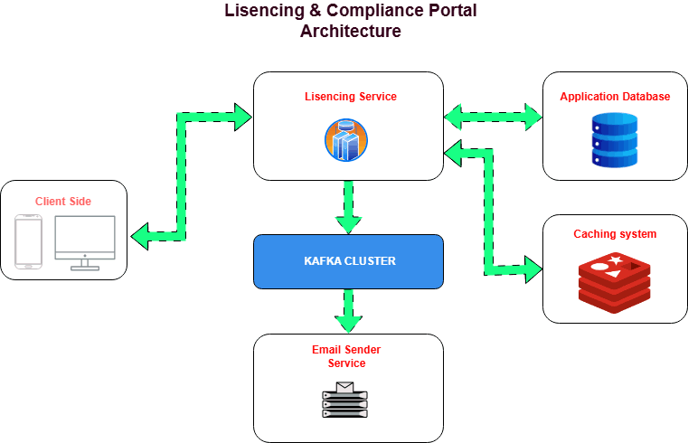
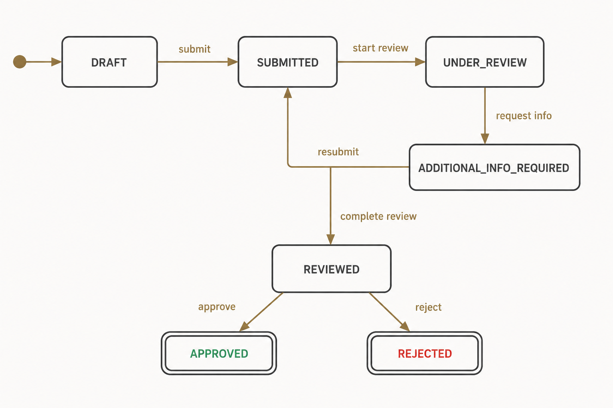

# Design Document

## Overview

This portal helps banks, insurance companies, microfinance institutions, and individuals apply for licenses from the National Bank of Rwanda.

Applicants submit applications and documents through the portal. Inside BNR, reviewers and approvers process the applications step by step until they are approved or rejected.

The goal was to keep the system simple, secure, and easy to understand.

---

# Architecture

## System Architecture

The system has 3 main parts:

| Component | Purpose |
|---|---|
| Frontend (React) | User interface used by applicants and BNR staff |
| Licensing Service (NestJS) | Main backend API that handles applications, users, documents, and approvals |
| Mailing Service (NestJS) | Sends emails in the background |

---

## How Components Communicate

1. The frontend sends requests to the Licensing Service
2. The Licensing Service stores data in MySQL
3. When an email is needed, the Licensing Service sends an event through Kafka
4. The Mailing Service receives the event and sends the email
5. Redis is used for caching, OTP storage, and queues
6. MinIO stores uploaded files

---

## Why This Structure

The backend was split into two services because sending emails should not slow down the main application.

The Licensing Service focuses on business logic while the Mailing Service handles email jobs separately.

This keeps the API fast and makes retries easier if email delivery fails.

---

# Data Model

## Users

Stores all users in the system.

| Field | Description |
|---|---|
| id | User ID |
| full_name | User full name |
| email | Login email |
| password_hash | Encrypted password |
| role | APPLICANT, REVIEWER, APPROVER, ADMIN |
| department_id | User department |
| applicant_type | INDIVIDUAL or ORGANIZATION |
| institution_name | Organization name |
| is_active | Account status |

---

## Applications

Stores license applications.

| Field | Description |
|---|---|
| id | Application ID |
| reference_id | Human-readable reference |
| applicant_id | Owner of application |
| license_type_id | Selected license |
| department_id | Responsible department |
| status | Current application state |
| reviewer_id | Assigned reviewer |
| approver_id | Assigned approver |
| submission_version | Tracks resubmissions |
| submitted_at | Submission time |
| decided_at | Final decision time |

---

## Documents

Stores uploaded files.

| Field | Description |
|---|---|
| id | Document ID |
| application_id | Related application |
| original_name | Uploaded filename |
| object_key | File path in storage |
| mime_type | File type |
| size | File size |
| status | READY, PENDING_UPLOAD, REJECTED |
| uploader_id | User who uploaded |

Files are stored in MinIO.

---

## Audit Logs

Stores activity history.

| Field | Description |
|---|---|
| id | Audit ID |
| application_id | Related application |
| actor_id | User who performed action |
| action | Action name |
| previous_state | Old status |
| new_state | New status |
| timestamp | Action time |

The audit log helps track everything that happens in the system.

---

# State Machine

## Application Workflow

---

## Application States

| State | Meaning |
|---|---|
| DRAFT | Application is being prepared |
| SUBMITTED | Sent for review |
| UNDER_REVIEW | Reviewer is checking it |
| ADDITIONAL_INFO_REQUIRED | More information needed |
| REVIEWED | Reviewer completed review |
| APPROVED | Application accepted |
| REJECTED | Application denied |

---

## Valid Transitions

| From | Action | To |
|---|---|---|
| DRAFT | submit | SUBMITTED |
| SUBMITTED | start review | UNDER_REVIEW |
| UNDER_REVIEW | request info | ADDITIONAL_INFO_REQUIRED |
| UNDER_REVIEW | complete review | REVIEWED |
| ADDITIONAL_INFO_REQUIRED | resubmit | SUBMITTED |
| REVIEWED | approve | APPROVED |
| REVIEWED | reject | REJECTED |

No other transitions are allowed.

---

## Rules Behind the Workflow

### One reviewer at a time

Once a reviewer starts reviewing an application, only that reviewer can continue working on it.

This avoids conflicts and confusion.

---

### Department-based access

Reviewers and approvers can only see applications from their department.

For example:

- Banking staff only see banking applications
- Insurance staff only see insurance applications

---

### Approved and rejected are final

Once an application is approved or rejected, it cannot move to another state.

If changes are needed later, a new application must be created.

---

### Every action is logged

Every important action creates an audit log entry.

This helps with tracking and accountability.

---

# Roles and Permissions

## Applicant

Can:

- Register and log in
- Create applications
- Upload documents
- Submit applications
- Respond to information requests
- View own applications

Cannot:

- Review applications
- Approve or reject applications
- Access other users' applications

---

## Reviewer

Can:

- View applications in their department
- Start review
- Request additional information
- Complete review
- Add comments

Cannot:

- Approve or reject applications
- Access other departments

---

## Approver

Can:

- View reviewed applications
- Approve applications
- Reject applications
- Add comments

Cannot:

- Start reviews
- Request additional information
- Access other departments

---

## Admin

Can:

- Manage users
- Manage departments
- Manage license types
- Manage requirements
- View audit logs

Cannot:

- Approve applications
- Review applications
- Make licensing decisions

---

## Why The Roles Were Split This Way

The reviewer and approver roles were separated to improve accountability.

The person checking an application should not be the same person making the final decision.

Admins were also separated from approval decisions. This keeps system management separate from business decisions.

---

# Hard Decisions and Trade-offs

## OTP Login

### What was implemented

Login uses:

- email and password
- a 6-digit OTP sent by email

The OTP expires after 5 minutes.

Redis stores temporary OTPs.

---

### Why

This adds extra security without making login too complicated.

---

### What could be improved later

- SMS OTP support
- better OTP rate limiting
- authenticator app support

---

## Role-Based Access

### What was implemented

Role guards protect endpoints.

Department checks are also done inside services.

---

### Why

Checking permissions only in controllers is not enough. Service-level checks add extra protection.

---

### What could be improved later

More advanced permission rules could be added later.

---

## Audit Trail

### What was implemented

Every important action writes to the audit log.

Audit records are never edited or deleted.

---

### Why

The system needs accountability and traceability.

---

### What could be improved later

- audit admin actions
- export audit reports
- move logs to immutable storage

---

## Document Upload Validation

### What was implemented

Files upload directly to MinIO using presigned URLs.

Uploaded files are validated before being accepted.

Allowed files:

- PDF
- PNG
- JPG
- DOC
- DOCX

---

### Why

Direct uploads reduce backend load and improve performance.

Validation helps prevent unsafe files.

---

### What could be improved later

- virus scanning
- resumable uploads
- larger file support

---

## Asynchronous Email

### What was implemented

Emails are sent through Kafka and processed by the Mailing Service.

---

### Why

This prevents email delays from slowing down the main API.

---

### What could be improved later

- email templates
- retry dashboards
- SMS notifications

---

## Caching

### What was implemented

Redis caches lookup data like:

- departments
- license types
- institution types

---

### Why

These values change rarely but are requested often.

Caching improves speed and reduces database load.

---

### What could be improved later

- smarter cache invalidation
- monitoring cache performance

---

# Final Notes

The main goal of this project was to build a licensing system that is:

- simple
- secure
- easy to maintain
- easy to understand

The design focused more on clean structure and clear responsibilities than adding unnecessary complexity.